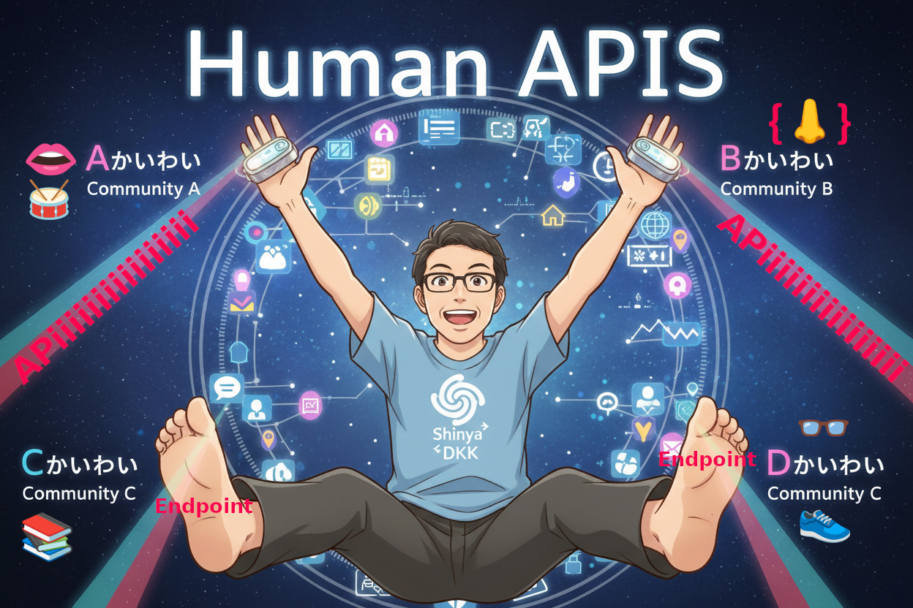
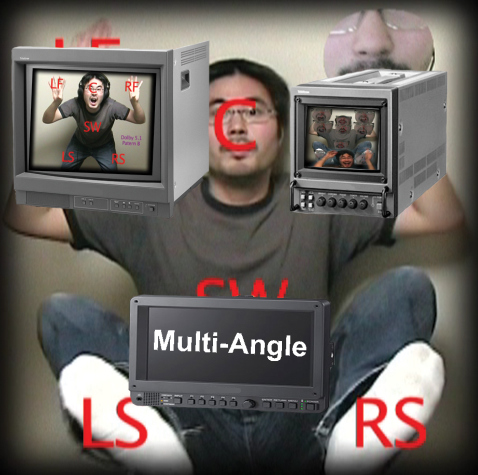

# 🌐 Human APIs - Human as an API (HaaA)

## In search of ways to bridge various communities via a Human API.

## 👋 Welcome

Hello, I'm Shinya Ihara.

Everyday, I am trying to explore connections not only within the programming community but also across various different communities, based on my philosophy that **human extremities (hands, feet, etc.) may function like API endpoints**.

## 💡 Concept: Human APIs

From an AI's perspective, could humans be seen as entities with API-like interfaces?

- **Right arm tip** is an endpoint to `Community A`
- **Left arm tip** is an endpoint to `Community B`
- **Right foot tip** is an endpoint to `Community C`
- **Left foot tip** is an endpoint to `Community D`
- Other physical extremities

Each community has its own culture, language, and protocols. While feeling nervous, I do not forget to approach each community step by step, searching for **common protocols** to connect with them.

## 🎬 Origins: Multi-Angle (Around 2010)

Around 2010, I was active as a musician. At that time, I didn't yet have the concept of "API."  
However, through an experimental DVD work that **utilized DVD multi-angle features while mapping each limb's extremity to each Dolby 5.1ch speakers**, I pursued the idea of **experiencing content simultaneously from multiple perspectives**.

Looking back, this may have been a manifestation of my desire to "connect with different perspectives and communities simultaneously."  
Right hand as left front speaker (LF), left hand as right front speaker (RF), face extremity as center speaker, my embarrassing belly extremity as subwoofer, right foot tip as left surround speaker (LS), left foot tip as right surround speaker (RS)—each "human endpoint" was an interface with people having different perspectives (or so I like to think).

※This [self-made DVD](#) was sold to some people when I was previously active as "Musical Persona."

## 🚀 The Journey Ahead

I will continue to step into various communities, engaging in dialogue with 'em carefully even though me-feeling nervous, then refining my role as **human API interface**.

- 🎵 Music
- 💻 Programming
- 🎨 Creative
- 📚 Learning
- 🤝 Community

Connecting different communities and creating new value—this may be what I aspire to become...

## 📫 Connect with Shinya's API

Feel free to access from each end (entry) point:

- 💻 "Me" as IT Solution Persona: [@Shinya-GitHub-Center](https://github.com/Shinya-GitHub-Center)
- 🌟 **Portfolio Site**: Coming soon...
- 🎵 "Me" as Musical Persona: [@Dokaka](https://dokaka.com/contact)

### "Every human is an API, connecting different worlds through their unique endpoints."

※ This profile text was written approximately 30% by AI and 70% by me (human).

---

# 🌐 Human APIs - 人間をAPIとして捉える

## ヒューマンAPIを通じて様々な界隈をつなぐ役割を探して。。。

## 👋 ようこそ / Welcome

はじめまして、Shinya Iharaです。

私は、**人間の先端部（手足等）がAPIエンドポイントのように働くのではないか**という哲学のもと、プログラミング界隈だけでなく、様々な異なる界隈とのつながりを探求しています。

## 💡 コンセプト：Human APIs

人間とはAI側から見ると、あたかもAPIのようなインターフェースを持つ存在ではないだろうか。。。

- **右腕先端部** は `A界隈` とのエンドポイント
- **左腕先端部** は `B界隈` とのエンドポイント  
- **右足先端部** は `C界隈` とのエンドポイント
- **左足先端部** は `D界隈` とのエンドポイント
- その他の肉体的先端部

それぞれの界隈には異なる文化や言語、プロトコルがあります。私は、ビビリながらも、それぞれの界隈と**共通のプロトコル**を探しながら、一歩一歩近づいていきたいと考えています。

## 🎬 原点：マルチアングル（2010年前後）

2010年前後、私はミュージシャンとして活動していました。当時はまだ「API」という概念が私にはありませんでした。  
しかし、**DVDのマルチアングル機能を利用しつつ、各手足の先端部をドルビー5.1chの各スピーカーに対応させるシュミレーションを行う**という実験的DVD作品を通じて、**複数の視点から同時にコンテンツを体験する**という考え方を追求していました。

これは、今思えば「異なる視点やコミュニティと同時につながりたい」という願望の現れだったのかもしれません。  
右手が左フロントスピーカー（LF）、左手が右フロントスピーカー（RF）、顔という先端部がセンタースピーカー、おなかという先端部がスーパーウーファー、右足先端部が左リアスピーカー（LS）、左足先端部が右リアスピーカー（RS）――それぞれの「ヒューマン・エンドポイント」が、異なる視点を持つ人々とのインターフェースでした（勝手にそう思ってるだけかもしれません）

※この[自作DVD](#)は、私が以前「ミュージカルペルソナ」として活動していた時に一部の方々に販売していたものです。

## 🚀 これからの旅

私は、これからも様々な界隈へと足を踏み入れ、ビビリながらもしっかりと対話を重ねながら、**人間としてのAPIインターフェース**を磨いていきます。

- 🎵 音楽
- 💻 プログラミング
- 🎨 クリエイティブ
- 📚 学び
- 🤝 コミュニティ

異なる界隈をつなぎ、新しい価値を生み出すこと。それが私の目指す姿なのかもしれません。

## 📫 Shinya API とつながる

各エンド（エントリー）ポイントから、お気軽にアクセスしてください：

- 💻 ITソリューションペルソナとしての「私」: [@Shinya-GitHub-Center](https://github.com/Shinya-GitHub-Center)
- 🌟 **ポートフォリオサイト**: 準備中...
- 🎵 音楽ペルソナとしての「私」: [@Dokaka](https://dokaka.com/contact)

### 「すべての人間はAPIである。それぞれ独自のエンドポイントで異なる世界をつないでいる」

※ このプロフィール文章は約30％がAIが書き、残り70％が私（人間）が書きました。
